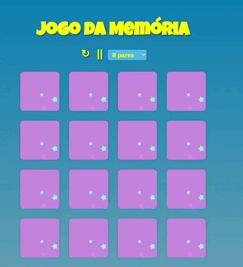

# Jogo da Memória 🧠 🕹️ 

  

  
  https://memory-game-git-main-ignacio-fabianamaria.vercel.app/

  

 

## :memo: Descrição

 Este é um jogo da memória em que o objetivo é encontrar todos os pares de cartas com emojis  iguais. O jogo é implementado usando a biblioteca React e oferece opções personalizáveis para escolher o tamanho do tabuleiro e ativar/desativar a música de fundo.

##  💻 Execução

- 01 Clone o repositório para a sua máquina
- 02 Abra o terminal na pasta do projeto e execute o comando npm install para instalar as dependências
- 03 Execute o comando npm start para iniciar o jogo em seu navegador
- 04 Escolha o tamanho do tabuleiro (6, 8 ou 10 pares)
- 05 Clique nas cartas para virá-las e encontrar pares iguais
- 06 Quando todos os pares forem encontrados, o jogo é finalizado

## :wrench: Tecnologias utilizadas

- CSS
- HTML
- React

